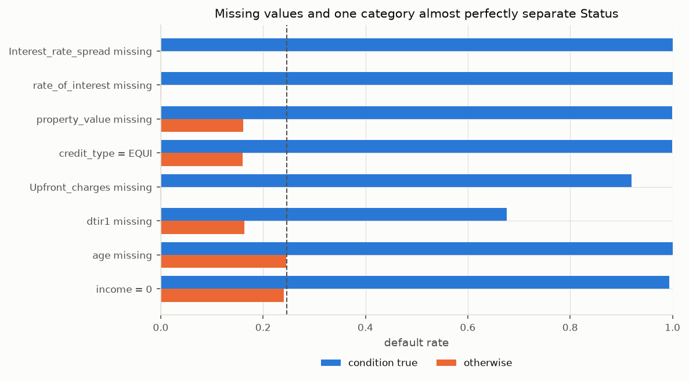

# Credit Risk PD Model: from raw loan data to monitored, validated Probability of Default

An end-to-end **Probability of Default (PD)** modelling project on loan-level data. It covers data quality, SQL analysis, an interpretable logistic regression, statistical validation, calibration, illustrative risk grades, monitoring and a Streamlit dashboard.

> **Disclaimer.** This is an educational portfolio project. It is **not** an official bank credit-scoring system, does **not** represent an underwriting decision and makes **no** claim of regulatory compliance. The risk grades are *illustrative internal risk grades for this project*.

**Status:** 🚧 in development. See the [roadmap](#roadmap).

---

## 1. Project objective
*To be completed in Stage 10.*

The goal is to show the full credit-risk modelling process, not just to maximise predictive accuracy. That means data-quality reasoning, leakage-free preprocessing, interpretable modelling, honest validation (discrimination **and** calibration), and monitoring after development.

## 2. Business context
*To be completed in Stage 10.*

## 3. Dataset
- **Source:** Yasser H., *Loan Default Dataset*, Kaggle: <https://www.kaggle.com/datasets/yasserh/loan-default-dataset>
- **Size:** about 148,670 loans × 34 columns. Target is `Status` (1 = default, 0 = non-default).
- **The raw data is not included in this repository** (see [decision D-002](docs/decision_log.md)). To reproduce the project, download `Loan_Default.csv` from Kaggle and place it at:

```
data/raw/Loan_Default.csv
```

## 4. Data-quality findings
Every data decision is recorded in [`docs/decision_log.md`](docs/decision_log.md) and labelled FACT, ASSUMPTION, HEURISTIC or MODELLING CHOICE.

**Stage 2 data pipeline** (`src/data_processing.py`):

```bash
python -m src.data_processing
```

The pipeline:
1. Loads `data/raw/Loan_Default.csv`. The raw file is never modified.
2. Checks that the file is the documented dataset (column names and order, a unique `ID`, and a binary `Status` with no missing values), and stops with an error if not.
3. Writes aggregate data-quality tables to `artifacts/dq_*.csv`: a summary, missingness vs `Status`, categorical levels and numeric profiles.
4. Applies only the documented cleaning rules. Rows are never deleted and raw columns are never overwritten:
   - `year` is dropped because it is constant (D-004);
   - `property_value_clean` sets `property_value` < 10,000 to missing (D-005, a heuristic affecting 6 rows);
   - `rate_of_interest_clean` sets rates ≤ 0 to missing (D-009, 1 row);
   - `LTV_clean` is recomputed as loan amount / cleaned property value (D-006);
   - `income_clean` sets income ≤ 0 to missing (D-008, 1,260 rows; added after Stage 3).
5. Saves `data/processed/loans_clean.parquet` (148,670 rows × 37 columns, gitignored).

**Verified facts (Stage 2):**
- 148,670 rows × 34 columns, and the schema matches exactly.
- `ID` is unique and there are no duplicate rows.
- `Status`: 112,031 zeros and 36,639 ones, a default rate of 24.64%.
- `year` = 2019 in every row.

**Stage 3 exploratory analysis** ([`notebooks/01_eda.ipynb`](notebooks/01_eda.ipynb), figures in `reports/figures/`). Every number below is checked by an `assert` in the notebook.

**Possible target leakage.** The missingness of several variables almost perfectly separates `Status`:
- `Interest_rate_spread` is missing if and only if `Status = 1`.
- All 36,439 rows with `rate_of_interest` missing are defaults.
- `credit_type = EQUI` and a missing `property_value` each have a 99.99% default rate.
- None of the 101,333 rows with all of rate, spread, upfront charges, `dtir1`, `property_value` and `income` present is a default. So no subset of rows is free of the pattern.



The cause cannot be established from the data. It may be how the dataset was assembled, or fields recorded after the outcome.

**Agreed treatment (D-017).** The main model uses only fields that would be captured for every applicant at decision time, and whose values or missingness are not driven by the outcome. This excludes:
- the pricing variables, `credit_type`, `property_value`/`LTV`, `dtir1`, `age` and `submission_of_application`;
- `Gender` (D-016) and `Credit_Score` (D-019);
- the redundant columns in D-018.

That leaves 16 candidate features. A full-feature model is built only as a clearly labelled leakage demonstration.

**Other Stage 3 facts:**
- `income = 0` (1,260 rows) has a 99.4% default rate, and still 97.7% outside EQUI. It is treated as missing in `income_clean` (D-008). A missing income is ordinary: those rows default at 13.5%.
- `Upfront_charges = 0` has a 0.26% default rate, against 0.11% for positive fees. Nothing contradicts the "no fee" reading (D-010).
- `Credit_Score` is uniform over 500–900, with a single-feature AUC of 0.503 and no correlation with other columns (D-019).
- Differences in default rate between category levels remain after the EQUI records are set aside, for example `loan_type` from 14.4% to 25.8%.

## 5. Methodology
*To be completed.*

```
Raw CSV → data-quality checks & cleaning → Parquet → DuckDB / SQL → model dataset
      → stratified 70/30 split → sklearn Pipeline (fitted on development/training data only)
      → logistic regression PD (5-fold CV within development/training set)
      → final evaluation on hold-out test set → validation & calibration
      → illustrative risk grades → monitoring (PSI) → Streamlit dashboard
```

**Sampling design (decision [D-013](docs/decision_log.md)):** 70% development/training set, with 5-fold cross-validation performed only within the development/training set, and a 30% final hold-out test set used once for final evaluation. This is out-of-sample, not out-of-time, validation.

## 6. SQL layer
*Stage 4.*

## 7. PD model
*Stage 5.*

## 8. Validation
*Stage 6.*

## 9. Illustrative risk grades
*Stage 7.*

## 10. Dashboard
*Stage 9. Screenshots will be added.*

## 11. Results
*To be filled with actual results. No numbers are reported before they have been produced.*

## 12. Limitations
*To be completed.* Known so far:
- The default definition behind `Status` is undocumented (D-015).
- `year` is 2019 for every loan, so the dataset has no genuine time dimension and true out-of-time validation is not possible (D-004).
- Several variables are missing almost only for defaulted loans, and are excluded from the main model (D-011, D-017). This includes LTV and debt-to-income, the core mortgage risk drivers. The main model is therefore a prototype built on data that failed its fitness-for-use check. In a real bank, the data would be sent back to its owner for remediation.
- `Credit_Score` carries no ranking power in this dataset (D-019).

## 13. Technologies
Python 3.11 · pandas · DuckDB (SQL) · scikit-learn · statsmodels · matplotlib · Plotly · Streamlit · pytest

---

## Getting started

```bash
git clone https://github.com/brunoreichamorim/credit_pd_model.git
cd credit_pd_model

python3.11 -m venv .venv
source .venv/bin/activate        # Windows: .venv\Scripts\activate
pip install -r requirements.txt

python -m src.data_processing    # needs data/raw/Loan_Default.csv
pytest                           # tests on the raw file are skipped if it is absent
```

## Project structure

```
credit_pd_model/
├── data/raw/            # Loan_Default.csv (placed manually, gitignored)
├── data/processed/      # cleaned Parquet + DuckDB database (generated, gitignored)
├── sql/                 # data quality, portfolio analysis, risk segmentation, model dataset
├── src/                 # config, data processing, db, model, validation, scoring, monitoring
├── notebooks/           # 01 EDA · 02 model training · 03 validation · 04 monitoring
├── tests/               # pytest checks
├── artifacts/           # data-quality tables (dq_*.csv), metrics, result tables (model binary gitignored)
├── reports/figures/     # figures used in this README
├── docs/decision_log.md # every decision, with its type and rationale
└── app.py               # Streamlit dashboard
```

## Roadmap

| # | Stage | Status |
|---|---|---|
| 1 | Project structure & environment | ✅ |
| 2 | Data pipeline (cleaning → Parquet) | ✅ |
| 3 | Exploratory data analysis & data-quality investigation | ✅ |
| 4 | SQL / DuckDB layer | ⏳ |
| 5 | Baseline logistic regression PD model | ⏳ |
| 6 | Validation & calibration | ⏳ |
| 7 | Illustrative risk grades | ⏳ |
| 8 | Monitoring (PSI / stability) | ⏳ |
| 9 | Streamlit dashboard | ⏳ |
| 10 | Final documentation | ⏳ |
