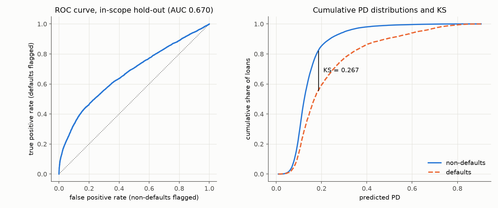
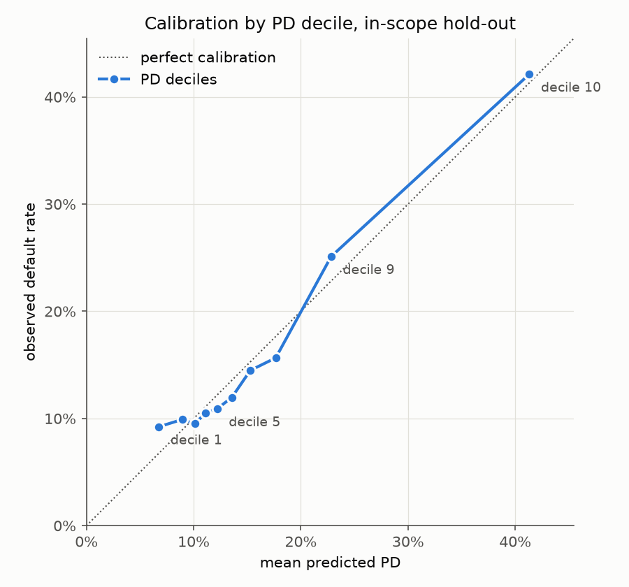
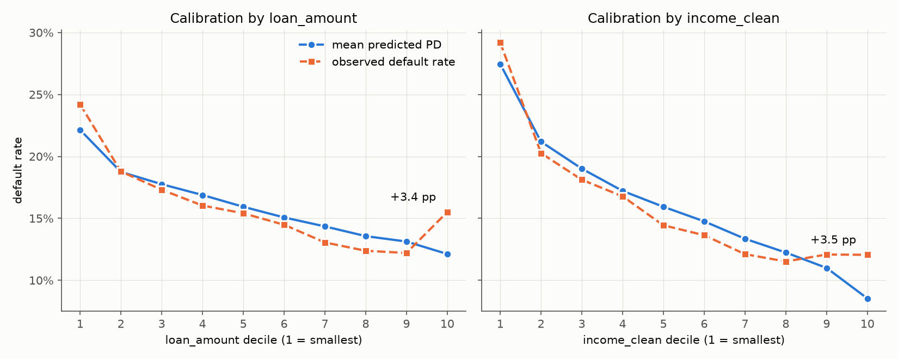
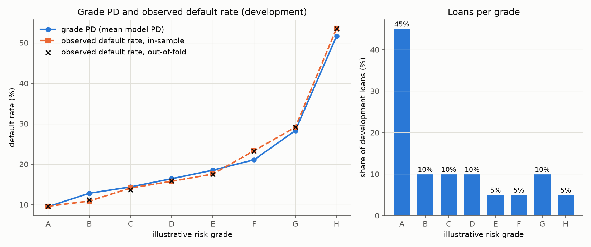
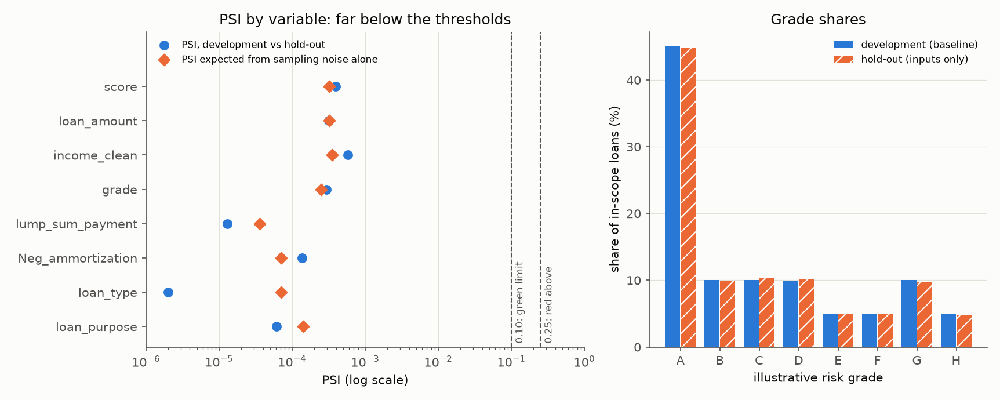

# Credit Risk PD Model: from raw loan data to monitored, validated Probability of Default

An end-to-end **Probability of Default (PD)** modelling project on loan-level data. It covers data quality, SQL analysis, an interpretable logistic regression, statistical validation, calibration, illustrative risk grades, monitoring and a Streamlit dashboard.

> **Disclaimer.** This is an educational portfolio project. It is **not** an official bank credit-scoring system, does **not** represent an underwriting decision and makes **no** claim of regulatory compliance. The risk grades are *illustrative internal risk grades for this project*.

**Status:** 🚧 in development. See the [roadmap](#roadmap).

---

## 1. Project objective
*To be completed in Stage 10.*

The goal is to show the full credit-risk modelling process, not just to maximise predictive accuracy. That means data-quality reasoning, leakage-free preprocessing, interpretable modelling, honest validation (discrimination **and** calibration), and monitoring after development.

## 2. Business context
*To be completed in Stage 10.*

## 3. Dataset
- **Source:** Yasser H., *Loan Default Dataset*, Kaggle: <https://www.kaggle.com/datasets/yasserh/loan-default-dataset>
- **Size:** about 148,670 loans × 34 columns. Target is `Status` (1 = default, 0 = non-default).
- **The raw data is not included in this repository** (see [decision D-002](docs/decision_log.md)). To reproduce the project, download `Loan_Default.csv` from Kaggle and place it at:

```
data/raw/Loan_Default.csv
```

## 4. Data-quality findings
Every data decision is recorded in [`docs/decision_log.md`](docs/decision_log.md) and labelled FACT, ASSUMPTION, HEURISTIC or MODELLING CHOICE.

**Stage 2 data pipeline** (`src/data_processing.py`):

```bash
python -m src.data_processing
```

The pipeline:
1. Loads `data/raw/Loan_Default.csv`. The raw file is never modified.
2. Checks that the file is the documented dataset (column names and order, a unique `ID`, and a binary `Status` with no missing values), and stops with an error if not.
3. Writes aggregate data-quality tables to `artifacts/dq_*.csv`: a summary, missingness vs `Status`, categorical levels and numeric profiles.
4. Applies only the documented cleaning rules. Rows are never deleted and raw columns are never overwritten:
   - `year` is dropped because it is constant (D-004);
   - `property_value_clean` sets `property_value` < 10,000 to missing (D-005, a heuristic affecting 6 rows);
   - `rate_of_interest_clean` sets rates ≤ 0 to missing (D-009, 1 row);
   - `LTV_clean` is recomputed as loan amount / cleaned property value (D-006);
   - `income_clean` sets income ≤ 0 to missing (D-008, 1,260 rows; added after Stage 3).
5. Saves `data/processed/loans_clean.parquet` (148,670 rows × 37 columns, gitignored).

**Verified facts (Stage 2):**
- 148,670 rows × 34 columns, and the schema matches exactly.
- `ID` is unique and there are no duplicate rows.
- `Status`: 112,031 zeros and 36,639 ones, a default rate of 24.64%.
- `year` = 2019 in every row.

**Stage 3 exploratory analysis** ([`notebooks/01_eda.ipynb`](notebooks/01_eda.ipynb), figures in `reports/figures/`). Every number below is checked by an `assert` in the notebook.

**Possible target leakage.** The missingness of several variables almost perfectly separates `Status`:
- `Interest_rate_spread` is missing if and only if `Status = 1`.
- All 36,439 rows with `rate_of_interest` missing are defaults.
- `credit_type = EQUI` and a missing `property_value` each have a 99.99% default rate.
- None of the 101,333 rows with all of rate, spread, upfront charges, `dtir1`, `property_value` and `income` present is a default. So no subset of rows is free of the pattern.


The cause cannot be established from the data. It may be how the dataset was assembled, or fields recorded after the outcome.

**Agreed treatment (D-017).** The main model uses only fields that would be captured for every applicant at decision time, and whose values or missingness are not driven by the outcome. This excludes:
- the pricing variables, `credit_type`, `property_value`/`LTV`, `dtir1`, `age` and `submission_of_application`;
- `Gender` (D-016) and `Credit_Score` (D-019);
- the redundant columns in D-018.

That leaves 16 candidate features. A full-feature model is built only as a clearly labelled leakage demonstration.

**Other Stage 3 facts:**
- `income = 0` (1,260 rows) has a 99.4% default rate, and still 97.7% outside EQUI. It is treated as missing in `income_clean` (D-008). A missing income is ordinary: those rows default at 13.5%.
- `Upfront_charges = 0` has a 0.26% default rate, against 0.11% for positive fees. Nothing contradicts the "no fee" reading (D-010).
- `Credit_Score` is uniform over 500–900, with a single-feature AUC of 0.503 and no correlation with other columns (D-019).
- Differences in default rate between category levels remain after the EQUI records are set aside, for example `loan_type` from 14.4% to 25.8%.

## 5. Methodology
*To be completed.*

```
Raw CSV → data-quality checks & cleaning → Parquet → DuckDB / SQL → model dataset
      → stratified 70/30 split → sklearn Pipeline (fitted on development/training data only)
      → logistic regression PD (5-fold CV within development/training set)
      → final evaluation on hold-out test set → validation & calibration
      → illustrative risk grades → monitoring (PSI) → Streamlit dashboard
```

**Sampling design (decision [D-013](docs/decision_log.md)):** 70% development/training set, with 5-fold cross-validation performed only within the development/training set, and a 30% final hold-out test set used once for final evaluation. This is out-of-sample, not out-of-time, validation.

## 6. SQL layer
**Stage 4** (`src/db.py`, queries in [`sql/`](sql/)):

```bash
python -m src.db    # needs data/processed/loans_clean.parquet from Stage 2
```

DuckDB is the single data source for the later stages (decision [D-020](docs/decision_log.md)). The database `data/processed/credit_risk.duckdb` (gitignored) holds:

| Object | Content |
|---|---|
| `loans_clean` | the processed Parquet, loaded as a table |
| `sample_split` | `ID` → `development` / `holdout`: the D-013 split, made once (stratified on `Status`, seed 42) |
| `model_dataset` | view with `ID`, `sample`, `Status` and **only** the 16 admissible features (D-017) |

The SQL files compute aggregate tables, saved as `artifacts/sql_*.csv`:
- `dq_reconciliation`, `dq_missingness`: the Stage 2 data-quality figures, recomputed in SQL (`UNPIVOT` over missing-value flags). Tests check that they match the pandas pipeline exactly.
- `portfolio_by_segment`: loans, exposure, and count-based and amount-weighted default rates by `loan_type`, `loan_purpose`, `Region`, `occupancy_type` and `term`.
- `risk_deciles`: default rate by equal-count bins (`NTILE`) of `loan_amount` and `income_clean`, for all loans and for loans outside `credit_type = EQUI`.
- `risk_segment_crosses`: default rates for two-way combinations of admissible features, for the same two populations.
- `split_summary`: size and default rate of each sample.

Segments with fewer than 10 loans are left out of the segment tables, so no committed row describes a single borrower (D-021).

**Verified facts (Stage 4):**
- Development sample: 104,069 loans, 24.644% default rate. Hold-out sample: 44,601 loans, 24.645%.
- Outside EQUI, the default rate falls from 30.3% in the lowest `income_clean` decile to 10.9–12.2% in the top three, and from 24.1% in the lowest `loan_amount` decile to 12.2% in the ninth (15.4% in the tenth).
- For `loan_type = type2`, the amount-weighted default rate is 32.0%, against a count-based 34.5%. The smaller type2 loans default more often.

## 7. PD model
**Stage 5** (`src/model.py`, notebook [`02_model_training.ipynb`](notebooks/02_model_training.ipynb)):

```bash
python -m src.model    # needs the DuckDB database from Stage 4 (python -m src.db)
```

Fitted only on the development sample (D-013), and only on loans inside the model's scope: loans with `credit_type = EQUI` (99.99% default) are left out of the model's population, but not deleted from the data (decision D-026, made after the first Stage 6 look). That leaves 93,391 development loans with a 16.0% default rate. The model uses 5-fold stratified cross-validation. All preprocessing (imputation, scaling, one-hot encoding) is fitted inside a scikit-learn Pipeline, on training folds only.

**Feature screening (decision D-022).** Of the 16 D-017 candidates, `term` and `co-applicant_credit_type` are dropped for cause -- `term`'s only real signal is an unexplained cell (`term = 300` with `Neg_ammortization`, 579 loans defaulting at 91.4% outside EQUI), and `co-applicant_credit_type` is a proxy for `credit_type = EQUI` whose effect direction reverses once EQUI is excluded. The remaining 10 candidates are screened by Information Value (outside EQUI); 6 pass:

| Feature | Coefficient | Direction |
|---|---:|---|
| `income_clean` | -0.415 | higher income -> lower PD |
| `lump_sum_payment = lpsm` | +2.490 | balloon payment -> higher PD |
| `Neg_ammortization = neg_amm` | +1.172 | negative amortisation -> higher PD |
| `loan_type = type2` (business/commercial) | +0.606 | higher PD |
| `loan_purpose = p2` | +0.361 | higher PD |
| `loan_amount` | +0.117 | see note below |

**Cross-validation results (mean over 5 folds, in-scope development sample):** AUC 0.675, Gini 0.349, KS 0.273, Brier 0.123. The feature screen used the whole development sample, so these are slightly optimistic; the Stage 6 hold-out is the out-of-sample check (D-022, D-025).

**`loan_amount` changes sign in the model.** On its own, a larger loan goes with a *lower* default rate, because larger loans go to higher-income borrowers. With `income_clean` in the model (the two are correlated at about 0.63 in log scale), the coefficient is small and positive: for the same income, a larger loan means higher leverage. It is kept, and the reasoning is recorded in D-023. The coefficient table still flags the mismatch with the univariate prior rather than hiding it.

**Leakage demonstration (option C, decision D-024).** A full model that adds back every D-017-excluded field, with their missing values kept visible, reaches a mean CV AUC of **1.000** on all development rows (EQUI included), and so does a model built from *only* the missing-value indicators of those fields (plus `credit_type`). This shows concretely how a model that ignored the D-017 investigation would look almost perfect while learning nothing about borrower risk. Neither leakage model is used for risk grades, monitoring or the dashboard.


## 8. Validation
**Stage 6** (`src/holdout.py`, metric functions in `src/validation.py`, SQL in `sql/validation_*.sql`, notebook [`03_validation.ipynb`](notebooks/03_validation.ipynb)):

```bash
python -m src.holdout    # needs the Stage 4 database and the Stage 5 model (python -m src.model)
```

The frozen Stage 5 model scores the in-scope part of the 30% hold-out: 39,981 loans. The 4,620 EQUI hold-out loans, which all defaulted, are counted but not scored (D-026). The pass/fail thresholds were written down before the first scoring (decision [D-025](docs/decision_log.md)); they are heuristics for this project, not regulatory standards. Results are in `artifacts/validation_*.csv`.

**Why the hold-out was looked at twice.** In the first look, the model was fitted on all development loans:
- Over all loans it looked well calibrated: mean PD 24.7% against an observed 24.6%.
- But that was two errors cancelling out. EQUI loans got a PD of about 30% and all defaulted, while every other loan was over-predicted (24.1% against 15.9%).
- The same bias was already visible in the development data.

The model was therefore refitted outside EQUI and the hold-out evaluated again (D-026). Because of this second look, the figures below are not a fully unbiased estimate.

**Hold-out results (in scope; out-of-sample, not out-of-time):**
- AUC 0.670 (95% bootstrap interval 0.662 to 0.678), Gini 0.341, KS 0.267, Brier 0.122. The cross-validation AUC was 0.675.
- Mean PD is 16.0% against an observed 15.9%, with a calibration slope of 1.01.
- Of the four pre-set criteria, three are green. One is amber: the largest gap between predicted and observed default rate in a PD decile is 2.5 pp (limit for green: 2 pp).
- The model under-predicts for the largest loans and the highest incomes, each top decile by about 3.5 pp. Both gaps are inside the amber limit, and they are accepted as a documented limitation (D-023).
- Coefficients refitted on the hold-out, as a diagnostic only, keep their sign for 9 of 10 terms. The exception, `loan_purpose = p4`, is not significant in either sample.






## 9. Illustrative risk grades
**Stage 7** (`src/grades.py`, SQL in `sql/grade*.sql`, notebook [`04_risk_grades.ipynb`](notebooks/04_risk_grades.ipynb)):

```bash
python -m src.grades    # needs pd_scores from Stage 6 (python -m src.holdout)
```

These are *illustrative internal risk grades for this project* (D-014), not an official or regulatory grading scale. The scale is built and checked on development loans only. No hold-out outcome is used (D-025), and EQUI loans get no grade (D-026).

**Why not ten equal-count grades.** The observed default rate is flat at about 9-10% across the lowest ~45% of loans, and the lowest-PD decile defaults *more* often than the next two. Ten equal-count grades would not rise from grade to grade.

**Construction (decision [D-027](docs/decision_log.md)).** Start from 20 equal-count PD bins. Merge adjacent bins until three conditions hold:
- every grade defaults significantly more than the one below (one-sided test, p < 0.05);
- every grade holds at least 5% of loans;
- there are at most 10 grades.

These thresholds are heuristics, set before the final run. Each grade's PD is the mean model PD of its loans. DuckDB stores the scale as the table `grade_scale`, and the view `pd_grades` assigns grades with a range join.

**Result: 8 grades** (development, in scope; `artifacts/grades_scale.csv`):

| Grade | PD range | Share of loans | Grade PD | Observed default rate |
|---|---|---:|---:|---:|
| A | < 12.16% | 45.0% | 9.5% | 9.6% |
| B | 12.16-13.52% | 10.0% | 12.8% | 10.9% |
| C | 13.52-15.32% | 10.0% | 14.4% | 14.1% |
| D | 15.32-17.69% | 10.0% | 16.4% | 15.8% |
| E | 17.69-19.54% | 5.0% | 18.5% | 17.6% |
| F | 19.54-22.86% | 5.0% | 21.1% | 23.3% |
| G | 22.86-36.52% | 10.0% | 28.3% | 29.1% |
| H | ≥ 36.52% | 5.0% | 51.6% | 53.6% |

- Default rates rise from grade to grade in-sample, on out-of-fold PDs (each loan scored by the Stage 5 fold model that did not see it), and in each of the 5 folds.
- **Grade A holds 45% of loans.** The model cannot rank risk below a PD of about 12%, so one grade covers that range.
- **The number of grades is not robust.** With the same rules, rounding the boundaries differently or starting from 19 bins gives 7 or 10 grades. The pre-set settings were kept.
- In-sample, grade PD and observed rate differ by at most 2.3 pp. This describes the development data; it is not a validation result.



## 10. Monitoring
**Stage 8** (`src/monitoring.py`, SQL in `sql/monitoring_*.sql`, notebook [`05_monitoring.ipynb`](notebooks/05_monitoring.ipynb), plan in [`docs/monitoring_plan.md`](docs/monitoring_plan.md)):

```bash
python -m src.monitoring    # needs pd_grades from Stage 7 (python -m src.grades)
```

**What this can and cannot show.** `year` is 2019 for every loan (D-004), and the hold-out is a random, stratified sample of the same population (D-013). There is no later period, so there is no drift to detect, and the PSI is close to zero by construction. The run shows that the monitoring works. **It is not evidence that the model is stable over time.**

**Design (decision [D-028](docs/decision_log.md), set before the first run):**
- **Baseline:** in-scope development loans. Bins are frozen on them and stored in DuckDB (`monitoring_baseline`).
- **Monitored sample:** the hold-out, standing in for a "next period". Only its **inputs and scores** are read, never its outcomes (D-025).
- **Metrics:** PSI of the PD score (10 development deciles), of the 8 grades, and of each of the 6 model features (with `<missing>` and `<unseen>` bins), plus a characteristic analysis and a watch list. The view `monitoring_bin_counts` bins every loan with a range join, and the PSI per bin is computed in SQL.
- **Lights:** PSI ≤ 0.10 green, ≤ 0.25 amber, > 0.25 red. This is a conventional rule of thumb, not a standard. A χ² p-value is reported next to it, to show whether a PSI exceeds sampling noise.
- **Per-grade backtest:** computed on development outcomes only, as the reference a future backtest would be compared with.

**First run (development vs hold-out, in scope; `artifacts/monitoring_*.csv`):**
- Every PSI is green, between 0.0000 and 0.0006. The score's PSI is 0.0004, against 0.0003 expected from sampling noise alone, and no χ² p-value is below 0.05.
- **Watch list, all green.** These are the model's known weak points:
  - top `loan_amount` / `income_clean` decile shares: 10.1% / 9.4% development, 9.8% / 9.3% hold-out (the D-023 misfit);
  - grade A: 45.0% / 44.9% (D-027);
  - EQUI share, which is not scored: 10.3% / 10.4% (D-026);
  - no unseen categorical levels.



## 11. Dashboard
*Stage 9. Screenshots will be added.*

## 12. Results
*To be filled with actual results. No numbers are reported before they have been produced.*

## 13. Limitations
*To be completed.* Known so far:
- The default definition behind `Status` is undocumented (D-015).
- `year` is 2019 for every loan, so the dataset has no genuine time dimension and true out-of-time validation is not possible (D-004).
- Several variables are missing almost only for defaulted loans, and are excluded from the main model (D-011, D-017). This includes LTV and debt-to-income, the core mortgage risk drivers. The main model is therefore a prototype built on data that failed its fitness-for-use check. In a real bank, the data would be sent back to its owner for remediation.
- `Credit_Score` carries no ranking power in this dataset (D-019).
- The model covers only loans outside `credit_type = EQUI` (D-026). It says nothing about EQUI loans, which all defaulted.
- The hold-out was evaluated twice, before and after the D-026 refit, so the hold-out results are not a fully unbiased estimate (D-025).
- The model under-predicts in the top `loan_amount` and `income_clean` deciles by about 3.5 pp, and for `loan_purpose = p2` by 4.3 pp (D-023, D-025).
- The model does not separate risk among the lowest-PD half of loans, so the best illustrative grade holds 45% of loans. The number of grades (8) depends on technical settings of the grading rule (D-027).
- Monitoring cannot detect drift: the data has no time dimension and the hold-out is a random sample of the same population, so the near-zero PSI is a sanity check, not evidence of stability. Per-grade backtesting needs outcomes from a new period (D-028).

## 14. Technologies
Python 3.11 · pandas · DuckDB (SQL) · scikit-learn · statsmodels · matplotlib · Plotly · Streamlit · pytest

---

## Getting started

```bash
git clone https://github.com/brunoreichamorim/credit_pd_model.git
cd credit_pd_model

python3.11 -m venv .venv
source .venv/bin/activate        # Windows: .venv\Scripts\activate
pip install -r requirements.txt

python -m src.data_processing    # needs data/raw/Loan_Default.csv
python -m src.db                 # builds the DuckDB database and sql_*.csv tables
pytest                           # tests on the raw file are skipped if it is absent
```

## Project structure

```
credit_pd_model/
├── data/raw/            # Loan_Default.csv (placed manually, gitignored)
├── data/processed/      # cleaned Parquet + DuckDB database (generated, gitignored)
├── sql/                 # data quality, portfolio analysis, risk segmentation, model dataset
├── src/                 # config, data processing, db, model, validation, scoring, monitoring
├── notebooks/           # 01 EDA · 02 model training · 03 validation · 04 risk grades · 05 monitoring
├── tests/               # pytest checks
├── artifacts/           # data-quality tables (dq_*.csv), metrics, result tables (model binary gitignored)
├── reports/figures/     # figures used in this README
├── docs/decision_log.md # every decision, with its type and rationale
└── app.py               # Streamlit dashboard
```

## Roadmap

| # | Stage | Status |
|---|---|---|
| 1 | Project structure & environment | ✅ |
| 2 | Data pipeline (cleaning → Parquet) | ✅ |
| 3 | Exploratory data analysis & data-quality investigation | ✅ |
| 4 | SQL / DuckDB layer | ✅ |
| 5 | Baseline logistic regression PD model | ✅ |
| 6 | Validation & calibration | ✅ |
| 7 | Illustrative risk grades | ✅ |
| 8 | Monitoring (PSI / stability) | ✅ |
| 9 | Streamlit dashboard | ⏳ |
| 10 | Final documentation | ⏳ |
